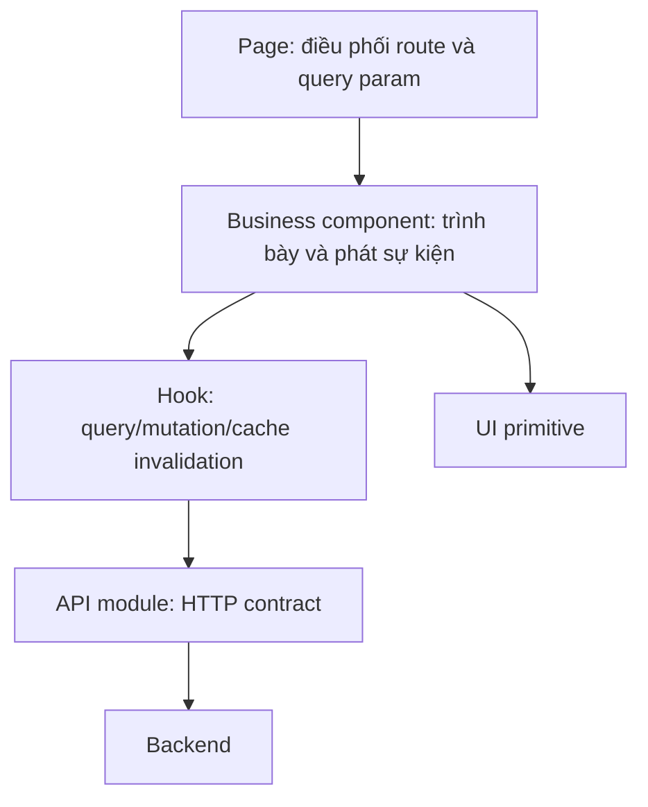
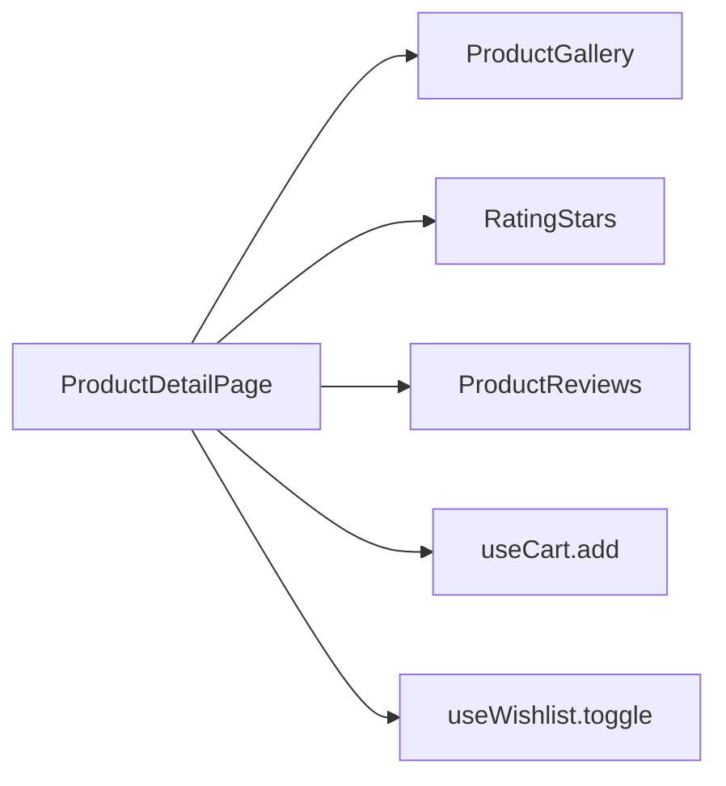
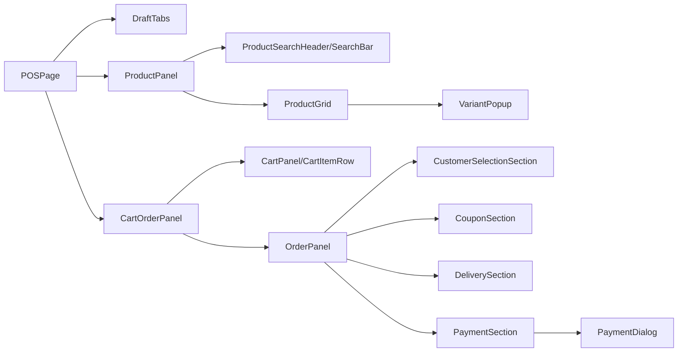

# Tài liệu component theo chức năng

## 1. Cách đọc tài liệu

Tài liệu này đi từ Page xuống component nghiệp vụ. Mỗi component được mô tả theo bốn ý: trách nhiệm hiển thị, dữ liệu đầu vào, sự kiện/thao tác phát ra và hook/API chịu trách nhiệm lưu dữ liệu. Các file trong `components/ui` là primitive giao diện Shadcn/Radix nên được mô tả theo nhóm, không lặp lại từng button/input.

Nguyên tắc phân tầng:

Component không được tự quyết định giá cuối, tồn kho, quyền hay chuyển trạng thái. Các giá trị đó phải được BE xác nhận.

# Phần A — Component storefront (`fe`)

## 2. Layout, điều hướng và component dùng chung

| Component | Chức năng chi tiết | Dữ liệu/sự kiện |
|---|---|---|
| `StoreHeader` | Header toàn website; logo, menu catalog, tìm kiếm, tài khoản, cart và wishlist badge. Theo dõi số lượng cart/wishlist khi có phiên USER; điều hướng login/account/logout. | Đọc auth store/hook, `useCart`, `useWishlist`; phát navigation và logout. |
| `StoreFooter` | Footer thông tin cửa hàng, liên kết nhanh, chính sách và kênh liên hệ. | Chủ yếu dữ liệu tĩnh; không ghi BE. |
| `StoreLayout` | Ghép Header, `Outlet`, Footer và `ChatPopup`; giữ cấu trúc nhất quán giữa các trang storefront. | Nhận route con qua Outlet. |
| `AuthLayout` | Khung form login/register/forgot/reset, tránh lặp bố cục xác thực. | Render Outlet. |
| `PrivateRoute` | Chặn route cá nhân nếu không có refresh token; lưu đường dẫn hiện tại để quay lại sau đăng nhập. | Đọc cookie, render Outlet hoặc Navigate. |
| `AccountLayout` | Sidebar tài khoản cho `/account`, `/orders`, `/returns`, `/addresses`, `/reviews`; đánh dấu mục đang chọn. | Prop `children`, đọc location, phát navigation. |
| `Pagination` | Chuẩn hóa nút trước/sau, số trang và disabled state. | Props page/totalPages/onPageChange; không tự gọi API. |
| `ThemeProvider` | Quản lý light/dark/system theme. | Bọc ứng dụng, lưu theme phía client. |

## 3. Component sản phẩm

| Component | Chức năng chi tiết | Dữ liệu/sự kiện |
|---|---|---|
| `ProductGrid` | Nhận mảng sản phẩm và dựng lưới responsive; hiển thị empty/loading phù hợp, ủy quyền từng ô cho `ProductCard`. | Props `products`, trạng thái loading/empty tùy implementation. |
| `ProductCard` | Ảnh, tên, rating, giá gốc/giá promotion, badge giảm và trạng thái hết hàng; click mở detail, thao tác wishlist. | Prop `ProductResponse`; gọi wishlist hook khi bấm tim. |
| `ProductGallery` | Ảnh chính và thumbnail; đổi ảnh theo lựa chọn, hỗ trợ ảnh variant. | Props danh sách ảnh, ảnh/variant được chọn; local selected index. |
| `RatingStars` | Hiển thị hoặc chọn số sao. | Props rating, size/readOnly/onChange; không gọi API. |
| `ProductReviews` | Tải review theo product, summary, filter sao và pagination; kết hợp `RatingStars`. | Prop `productId`; `reviewApi.getByProduct`, `getSummary`. |

Quan hệ ở trang chi tiết:

`ProductDetailPage` giữ state variant/size/color/quantity. Component chỉ cho chọn tổ hợp có thật; trước add cart vẫn gửi `variantId` và quantity để BE kiểm tra lại tồn.

## 4. Component địa chỉ và checkout

### `AddressModal`

Được dùng ở `AddressPage` và `CheckoutPage` cho cả create/update. Props chính gồm trạng thái mở, địa chỉ đang sửa, callback đóng và callback thành công. Component:

1. Khởi tạo form từ address hoặc rỗng.
2. Chọn tỉnh/huyện/xã bằng hook địa chỉ Việt Nam/GHN.
3. Reset cấp dưới khi cấp trên thay đổi.
4. Validate người nhận, phone và địa chỉ chi tiết.
5. Gọi create/update address mutation.
6. Đóng modal và yêu cầu parent cập nhật địa chỉ được chọn.

### Các phần checkout hiện nằm trong `CheckoutPage`

Checkout chưa tách thành component domain riêng; Page trực tiếp quản lý:

| Khối chức năng | Trách nhiệm |
|---|---|
| Address selector | Chọn địa chỉ mặc định, mở `AddressModal`, kích hoạt tính lại phí ship. |
| Item summary | Hiển thị variant, quantity, giá gốc/giá hiện tại và thành tiền. |
| Coupon input | Nhập code, validate, bỏ coupon và tránh kết quả request cũ ghi đè request mới. |
| Coupon popup | Danh sách mã, tab khả dụng/chưa đủ điều kiện, điều kiện chi tiết và số tiền tiết kiệm. |
| Payment selector | Chọn COD/VNPAY theo enum BE hỗ trợ. |
| Total summary | Giá gốc, giảm sản phẩm, subtotal, shipping, giảm coupon và tổng phải trả. |
| Price-change dialog | Nhận lỗi 409, liệt kê giá cũ/mới và tổng mới; chỉ cập nhật checkout/coupon khi khách xác nhận tải lại. |

Nên tách các khối trên thành `CheckoutAddressSection`, `CheckoutCouponSection`, `CheckoutSummary` và `PriceChangeDialog` nếu Page tiếp tục mở rộng.

## 5. Component đơn hàng

| Component | Chức năng chi tiết | Dữ liệu/sự kiện |
|---|---|---|
| `OrderStatusBadge` | Ánh xạ `OrderStatus` sang nhãn/màu tiếng Việt thống nhất ở list/detail. | Prop `status`; pure component. |
| `OrderShopeeStepper` | Hiển thị tiến độ cấp cao; xử lý nhánh giao hàng, hoàn hàng, hủy/hỏng thay vì chỉ tăng tuyến tính. | Props `order`, `baseSteps` tùy chọn. |
| `OrderTimeline` | Dựng lịch sử từ transaction logs, hiển thị thời gian, người thao tác, previous/current status và note. | Prop `order`. |
| `OrderInfoCards` | Các card thông tin khách, địa chỉ giao, payment, tiền và ghi chú. | Prop `order`; format money/date. |
| `OrderItemsList` | Dòng hàng snapshot: ảnh, SKU, size/color, quantity, unit price, discount, total; liên kết review/return khi phù hợp. | Prop `order`. |
| `OrderReturnHistory` | Liệt kê ReturnRequest liên quan, loại, trạng thái, tiền hoàn và link chi tiết/lịch sử. | Props order/returns theo implementation. |

`OrderDetailPage` điều phối query Order, thao tác cancel/payment/return; các component trên chủ yếu trình bày và không tự mutation trạng thái.

## 6. Component review

### `ReviewForm`

Props gồm order detail/product cần đánh giá, review hiện tại khi sửa, trạng thái mở và callback hoàn tất/đóng. Component quản lý rating, comment, ảnh cũ và file mới:

- Create: multipart `POST /reviews`.
- Update: multipart `PUT /reviews/{id}`.
- Validate số sao và nội dung/file.
- Preview và loại ảnh trước submit.
- Sau thành công parent/hook invalidate review của tôi, sản phẩm chưa review và summary sản phẩm.

## 7. Component chat

### `ChatPopup`

Popup hỗ trợ nhanh được mount trong `StoreLayout`, độc lập với `ChatPage` toàn màn hình. Nó:

1. Kiểm tra phiên USER trước khi mở hội thoại.
2. Tải conversation hiện tại và các message gần nhất.
3. Tạo conversation khi khách gửi tin đầu tiên nếu chưa có.
4. Gửi text/ảnh multipart, cho chọn Order tham chiếu.
5. Subscribe Socket.IO để append message mới và cập nhật unread.
6. Đánh dấu đã đọc khi popup đang mở.
7. Cleanup listener khi unmount/đổi conversation để tránh nhân đôi message.

`ChatPage` triển khai chức năng tương tự ở layout rộng. REST là nguồn lịch sử; Socket chỉ dùng cập nhật realtime.

## 8. Các Page đang chứa logic component nội bộ

| Page | Các chức năng hiện được viết trực tiếp trong Page |
|---|---|
| `CartPage` | Chọn dòng, chọn tất cả, quantity input, remove, tổng các dòng được chọn và chuyển checkout. |
| `OrdersPage` | Tab/filter status, order card/table và pagination. |
| `ReturnRequestPage` | Item selector, quantity trả, refund preview, upload evidence, chọn type và submit. |
| `ReturnHistoryPage` | Return card/list, badge và pagination. |
| `AccountPage` | Form hồ sơ và form đổi mật khẩu. |
| `NotificationsPage` | Notification row, read/read-all/delete; BE chưa có contract. |
| `BlogDetailPage` | Comment list/form; BE chưa có contract. |

# Phần B — Component backoffice (`fe-admin`)

## 9. Khung ứng dụng và component dùng chung

| Component | Chức năng |
|---|---|
| `AppSidebar` | Menu theo role, nhóm catalog/sales/content/account; route ADMIN không hiển thị cho STAFF. |
| `Navbar` | Tiêu đề, theme, hồ sơ và logout. |
| `MainLayout` | Bọc sidebar/navbar và Outlet. |
| `PrivateRoute` | Gọi `/me`; loading hiển thị spinner, thất bại về login. |
| `RoleRoute` | So role thực tế với danh sách cho phép; sai quyền về dashboard. |
| `Pagination` | Pagination dùng chung cho các bảng. |
| `ConfirmModal` | Xác nhận thao tác nguy hiểm/toggle; props title, description, loading, onConfirm. |
| `AcceptModal` | Xác nhận hành động chấp nhận/duyệt theo ngữ cảnh. |
| `SearchableSelect` | Combobox tìm kiếm cho dataset dài. |
| `FieldError` | Hiển thị thông báo validation thống nhất bên dưới field, chỉ render khi có lỗi. |

Các primitive `button`, `input`, `select`, `dialog`, `table`, `card`, `badge`, `popover`, `command`, `sidebar`, `spinner`… chỉ chịu trách nhiệm accessibility/style; không gọi API.

## 10. Dashboard components

| Component | Chức năng/dữ liệu |
|---|---|
| `PeriodKpiCard` | KPI của kỳ hiện tại và tỷ lệ so kỳ trước; format tiền/số/chiều tăng giảm. |
| `KpiCards` | Nhóm KPI tổng quan cũ/tổng hợp. |
| `RevenueChart` | Recharts biểu diễn doanh thu theo tháng/quý/năm và khoảng ngày; chuẩn hóa các mốc thiếu thành 0. |
| `RevenueCompareDialog` | Hai form khoảng ngày, gọi statistics song song và so sánh doanh thu/đơn/đổi hàng. |
| `StaffDashboard` | Dashboard riêng STAFF; chọn preset/custom range, dựng line chart `revenue`, `refunds`, `orders`, recent orders và KPI cá nhân/phạm vi được phép. |
| `OrderStatusChart` | Phân bố đơn theo trạng thái. |
| `BestSellers` | Danh sách variant/product bán nhiều và doanh thu. |
| `SlowSellers` | Sản phẩm bán chậm để hỗ trợ quyết định promotion. |
| `LowStockProducts` | Biến thể sắp hết tồn; link quản lý variant. |
| `RecentOrdersTable` | Đơn gần nhất và link detail. |
| `TopCustomers` | Khách theo doanh số/số đơn. |
| `TopCoupons` | Coupon theo số lượt/doanh thu hỗ trợ. |
| `TopPromotions` | Promotion hiệu quả. |
| `SalesChannels` | So sánh POS và online. |
| `QuickActions` | Shortcut đến POS, tạo sản phẩm/đơn/chức năng thường dùng theo role. |
| `FashionTrends` | Widget xu hướng/nhóm sản phẩm; phụ thuộc dataset dashboard. |
| `dashboardUtils` | Tạo `fromDate/toDate` cho hôm nay, tuần, tháng, năm và format dữ liệu. |

Dashboard component không nên tự lọc khác quy tắc BE. Cùng một khoảng ngày phải dùng chung timezone và trạng thái đủ điều kiện tính doanh thu.

## 11. Category và Brand components

### Category

| Component | Trách nhiệm |
|---|---|
| `CategoryToolbar` | Keyword, status, sort, reset filter và export scope. |
| `CategoryTable` | Header/table state; map data thành `CategoryRow`. |
| `CategoryRow` | Hiển thị category, status và menu edit/delete/toggle. |
| `CategoryPagination` | Pagination chuyên biệt cũ; một số page dùng Pagination chung. |
| `CreateCategoryModal` | Form tạo, validate và gọi create mutation. |
| `UpdateCategoryModal` | Hydrate category đang chọn và update. |
| `CategoryModal` | Modal tổng quát/phiên bản dùng chung tùy page. |
| `UpdateStatusCategory` | Confirm và đổi status. |
| `ConfirmModalCategory` | Confirm xóa riêng category. |

### Brand

| Component | Trách nhiệm |
|---|---|
| `CreateBrandModal` | Form multipart tạo brand và logo preview. |
| `UpdateBrandModal` | Sửa metadata, giữ logo cũ khi không chọn file mới. |
| `UpdateStatusBrand` | Xác nhận thay đổi trạng thái. |

`BrandPage` hiện trực tiếp giữ toolbar/table/filter ngoài ba modal trên.

## 12. Product components

| Component | Chức năng chi tiết |
|---|---|
| `ProductForm` | Form create/edit Product; category, brand, mô tả, material, status, ảnh và submit multipart. Expose `ProductFormData` cho Page. |
| `ProductImageUpload` | Chọn nhiều ảnh, preview, đánh dấu ảnh chính, xóa ảnh cũ/mới và giới hạn file. |
| `ProductToolbar` | Search/filter category/brand/status/price, sort, bulk action và export. |
| `ProductTable` | Selection state và render `ProductRow`. |
| `ProductRow` | Snapshot sản phẩm, ảnh, trạng thái, rating, tồn tổng; menu detail/edit/delete/restore. |
| `ProductStatusBadge` | Ánh xạ ProductStatus sang nhãn/màu. |
| `PriceInput` | Input tiền có format hiển thị nhưng trả number chuẩn cho form. |

### Variant

| Component | Chức năng chi tiết |
|---|---|
| `ProductVariantToolbar` | Filter keyword/product/price/status; bulk delete/status và mở create. |
| `ProductVariantTable` | Selection, sort và danh sách `ProductVariantRow`. |
| `ProductVariantRow` | SKU, barcode, size, color, giá, tồn, status, ảnh; edit/delete/restore. |
| `ProductVariantForm` | Trường variant dùng lại cho modal create/edit. |
| `ProductVariantCreateModal` | Tạo một variant multipart, validate trùng tổ hợp và giá/tồn. |
| `ProductVariantEditModal` | Hydrate variant, update metadata/ảnh/status. |
| `VariantMatrixGenerator` | Sinh hàng loạt tổ hợp màu × size; cho nhập default rồi chỉnh từng dòng; tạo payload `variants` và files đúng thứ tự. |
| `ColorSelector` | Chọn/tạo danh sách màu cho matrix. |
| `SizeSelector` | Chọn/tạo size. |
| `ColorImageUpload` | Một ảnh đại diện theo màu, tái sử dụng cho các size cùng màu. |
| `DefaultValues` | Giá, cost price, stock và default áp dụng hàng loạt. |
| `variant-matrix/constants/types` | Contract state và option của matrix, không render UI. |

## 13. Coupon và Promotion components

### Coupon

| Component | Chức năng |
|---|---|
| `CouponToolbar` | Keyword, status/type/discountType/date/customer filter và export scope. |
| `CouponTable` | Selection/table, render `CouponRow`. |
| `CouponRow` | Code, loại, mức giảm, giới hạn, thời gian, trạng thái; edit/toggle. |
| `CouponPagination` | Điều hướng trang. |
| `CustomerMultiSelect` | Tìm và chọn nhiều Customer cho coupon PERSONAL; hiển thị chip và bỏ chọn. |

`CouponCreatePage` hiện tự chứa form lớn: thông tin code, điều kiện tiền, discount, giới hạn lượt, ngày và customer target.

### Promotion

| Component | Chức năng |
|---|---|
| `PromotionToolbar` | Filter keyword/status/date/type và export. |
| `PromotionTable` | Selection và render row. |
| `PromotionRow` | Mức giảm, thời gian, phạm vi, status; edit/cancel/status. |
| `ProductSelectorModal` | Tìm/chọn nhiều Product hoặc category theo contract form. |
| `VariantSelectorModal` | Lọc theo product và chọn variant cụ thể. |

`PromotionCreatePage` điều phối phạm vi category/product/variant và phải bảo đảm danh sách ID nhất quán trước submit.

## 14. Customer components

| Component | Chức năng chi tiết |
|---|---|
| `CustomerToolbar` | Search, source/status, sort và export. |
| `CustomerTable` | Selection và các action view/edit/status/address. |
| `CustomerForm` | Form dùng chung create/update: thông tin cá nhân, email, phone, source/status. |
| `CustomerAddressDialog` | Xem nhanh danh sách địa chỉ từ table. |
| `CustomerAddressManager` | CRUD nhiều address trong màn create/update; giữ default duy nhất. |
| `AddressFormDialog` | Form một address, chọn tỉnh/huyện/xã và validate. |
| `CustomerOrderHistory` | Tải/filter đơn của Customer và link detail. |

Khi status chuyển INACTIVE/BANNED, UI phải cảnh báo ảnh hưởng đăng nhập; BE vẫn thực thi khóa.

## 15. User/nhân viên components

| Component | Chức năng |
|---|---|
| `UserToolbar` | Search, role/status, sort và mở create. |
| `UserTable` | Danh sách, selection và render `UserRow`. |
| `UserRow` | Avatar, username/email/role/status, link detail và toggle status. |
| `UserStatCards` | Tổng/active/inactive/banned/staff/admin. |
| `UserModal` | Modal xem/tạo/sửa theo phiên bản dùng trong page. |
| `EditForm` | Form cập nhật User và avatar trong trang detail. |
| `UpdateStatusUser` | Confirm khóa/mở tài khoản. |
| `StaffOrderHistory` | Đơn do staff xử lý để đánh giá hoạt động. |
| `AddressSelect` | Chọn địa chỉ hành chính cho form User. |
| `CccdScannerModal` | Mở camera/QR, parse CCCD và trả dữ liệu vào form tạo User. |
| `useCccdScanner` | Quản lý quyền camera, lifecycle scanner và lỗi. |
| `parseCccdQR` | Parse chuỗi QR sang CCCD, tên, giới tính, ngày sinh, địa chỉ. |

## 16. Order components phía quản trị

| Component | Chức năng chi tiết |
|---|---|
| `OrderStatusController` | Tính các trạng thái kế tiếp hợp lệ theo order type/current status, nhập note và gọi update status. Không đưa dropdown toàn enum. |
| `OrderBulkStatusModal` | Nhận danh sách order ID, chọn trạng thái chung và submit bulk update. |
| `OrderDetailsModal` | Xem nhanh order từ list mà không chuyển route. |
| `OrderHeader` | Mã đơn, loại/kênh, thời gian, status và action. |
| `CustomerInfo` | Customer hoặc khách lẻ, phone/email và địa chỉ. |
| `OrderInfoCards` | Payment, tiền, shipping, note. |
| `OrderItemsList` | Snapshot dòng hàng. |
| `OrderShopeeStepper` | Tiến trình trực quan. |
| `OrderTimeline` | Transaction logs. |
| `OrderReturnHistory` | Các yêu cầu đổi trả liên quan. |

Các component cùng tên với storefront có mục đích hiển thị tương tự nhưng phiên bản admin thêm dữ liệu và action quản trị.

## 17. POS components

| Component | Chức năng chi tiết |
|---|---|
| `DraftTabs` | Danh sách draft, đổi draft hiện tại, tạo mới và yêu cầu xác nhận hủy. |
| `ProductPanel` | Điều phối tìm kiếm/filter/grid sản phẩm ở nửa trái POS. |
| `ProductSearchHeader`, `ProductSearchBar` | Search debounce, scan barcode, filter nhanh. |
| `ProductGrid` | Card sản phẩm/variant khả dụng cho POS. |
| `VariantPopup` | Chọn size/color/variant và quantity trước khi add draft. |
| `CartOrderPanel` | Khung nửa phải, phối hợp Cart và thông tin checkout. |
| `CartPanel` | Danh sách dòng draft và tổng tạm. |
| `CartItemRow` | Ảnh/SKU/thuộc tính/giá/quantity; gọi update/remove item. |
| `QuantityInput` | Chặn quantity âm/quá khả dụng, debounce update nếu có. BE vẫn kiểm tra cuối. |
| `OrderPanel` | Gom customer, coupon, delivery, payment và summary. |
| `CustomerSelectionSection` | Khách đang gắn, mở `CustomerPopup`, clear customer. |
| `CustomerPopup` | Tìm khách, chọn hoặc tạo nhanh. |
| `CouponSection` | Coupon hiện tại và mở popup. |
| `CouponPopup` | Tải mã, hiển thị đầy đủ điều kiện, validate theo subtotal và chọn/bỏ mã. |
| `DeliverySection` | Toggle mang về/giao hàng; địa chỉ và shipping fee. |
| `SavedAddressList` | Địa chỉ đã lưu của Customer. |
| `ManualAddressForm` | Địa chỉ giao nhập tay. |
| `PaymentSection` | Phương thức và tổng cần thu, mở xác nhận. |
| `CheckoutPanel` | Summary cuối và nút checkout chống gửi lặp. |
| `PaymentDialog` | Xác nhận tiền/phương thức trước gọi checkout API. |
| `InvoicePrintModal` | Format và in hóa đơn từ OrderResponse đã hoàn tất. |
| `posUtils` | Format/tính giá hiển thị; không thay thế tính tiền BE. |

Mỗi thao tác item phải đi qua `posApi`; chỉ response BE mới cập nhật draft hiện tại. Không tự tạo Reservation trong state client.

## 18. Return components

| Component | Chức năng chi tiết |
|---|---|
| `CreateReturnModal` | Wizard nhân viên tìm đơn, chọn REFUND/EXCHANGE, dòng trả, biến thể đổi, preview tiền và gửi create. |
| `ReturnOrderSearch` | Search Order theo code/khách và kiểm tra đủ điều kiện. |
| `ReturnItemRow` | Quantity trả, reason, refund price, variant đổi và price difference. |
| `ReturnCustomerSummary` | Khách, order, payment và tổng mua. |
| `ReturnDetailsInfo` | Metadata request, note, ảnh và người xử lý. |
| `ReturnDetailsItems` | Dòng trả/đổi, tiền hoàn/chênh lệch và damaged quantity. |
| `ReturnDetailsModal` | Xem nhanh từ list. |
| `ReturnProcessTimeline` | PENDING/APPROVED/REJECTED/COMPLETED và actor/time. |

`ReturnDetailPage` giữ mutation approve/reject/complete; component phát event, Page/hook gọi API rồi invalidate return statistics, order, payment và product variant.

## 19. Post components

| Component | Chức năng |
|---|---|
| `PostForm` | Title, slug, summary, TipTap content, thumbnail, category/tag và status; dùng ở create/edit. |
| `RichTextEditor` | TipTap toolbar: heading, bold/italic/underline, color, highlight, alignment, link, image. |
| `PostCategorySelector` | Chọn nhiều category. |
| `PostTagSelector` | Chọn nhiều tag. |
| `PostToolbar` | Filter/search/status/category/tag. |
| `PostTable` | Danh sách và render trạng thái/action. |
| `PostPagination` | Pagination. |
| `PostStatCards` | Thống kê bài; phụ thuộc endpoint statistics hiện chưa có ở BE. |
| `PostStatusBadge` | Màu/nhãn trạng thái. |
| `PostConfirmModal`, `PostModal` | Confirm/xem nhanh tùy action. |
| `PostCategoryModal`, `PostTagModal` | CRUD taxonomy. |

## 20. Review, Contact, Banner, Supplier và Inventory

| Component | Chức năng |
|---|---|
| `ReviewFilters` | Keyword/rating/status filter. |
| `ReviewItemCard` | Customer, product, rating, comment, images và nút approve/reject/hide. |
| `ContactHeader` | Tiêu đề, filter và số liệu contact. |
| `ContactInfo` | Trình bày thông tin người gửi/nội dung. |
| `ContactDetailsModal` | Xem chi tiết, đổi trạng thái và xóa. |
| `BannerModal` | Create/update banner multipart, ảnh preview, thời gian, link và display order. |
| `SupplierModal` | CRUD supplier UI; hiện chưa có BE contract. |
| `InventoryAdjustmentModal` | Form điều chỉnh tồn/lý do; hiện chưa có BE contract. |
| `GoodsReceiptModal` | Form phiếu nhập và các dòng hàng; hiện chưa có BE contract. |

## 21. Quy tắc phối hợp Page–Component–Hook

Ví dụ mutation chuẩn:

1. Page mở modal và truyền entity/ID.
2. Component quản lý form, validate và gọi callback `onSubmit(payload)` hoặc mutation hook.
3. Hook gọi API module, hiển thị toast và invalidate mọi query key bị ảnh hưởng.
4. Page đóng modal, reset selection; table tự nhận dữ liệu cache mới.
5. Lỗi 400 giữ form và hiển thị field/general error; 401 về login; 403 báo sai quyền; 409 chạy luồng xác nhận đặc thù.

Không nên để cả Page và component cùng gọi một mutation cho một nút, vì dễ tạo request kép. Các action checkout, payment, update status và complete return phải disable trong khi pending.

## 22. Đề xuất tách component tiếp theo

- `CheckoutPage`: tách address, coupon, summary và price-change dialog.
- `ReturnRequestPage`: tách return item selector, evidence upload và refund summary.
- `ChatPage`: chia conversation list, message list, composer và order selector dùng chung với `ChatPopup`.
- `CouponCreatePage`/`PromotionCreatePage`: tách condition form, schedule form và target selector.
- `OrderPage`: tách filter toolbar và table/row để đồng nhất các module CRUD.

## 23. Tài liệu liên quan

- [Chi tiết hooks và API frontend](./frontend-hooks-api-documentation.md)
- [Mô tả frontend theo trang và luồng](./frontend-documentation.md)
- [Tài liệu API Backend](./api-function-documentation.md)
- [Quy trình nghiệp vụ](./business-flows.md)
- [Sơ đồ trạng thái](./state-diagrams.md)
