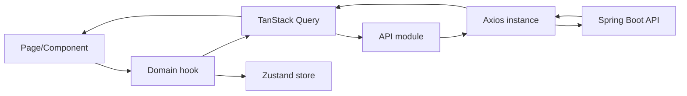

# Tài liệu Frontend khách hàng và Frontend quản trị

## 1. Tổng quan kiến trúc

Repository có hai ứng dụng React độc lập:

| Ứng dụng   | Thư mục    | Đối tượng                                | URL phát triển thường dùng           |
| ---------- | ---------- | ---------------------------------------- | ------------------------------------ |
| Storefront | `fe`       | Khách mua hàng (`USER`)                  | Vite, thường `http://localhost:5173` |
| Backoffice | `fe-admin` | Nhân viên và quản trị (`STAFF`, `ADMIN`) | Vite, thường `http://localhost:5174` |

Cả hai dùng React 19, TypeScript, Vite, React Router, Axios, TanStack Query, Zustand, Tailwind/Shadcn và Sonner. `fe-admin` dùng thêm Recharts cho dashboard, TipTap cho bài viết, QR scanner cho CCCD và XLSX cho xuất báo cáo.

Biến môi trường chung:

```env
VITE_API_URL=http://localhost:8080/api/v1
```

Luồng dữ liệu chung:



- `pages/`: màn hình gắn với route.
- `components/`: UI dùng lại hoặc component nghiệp vụ.
- `hooks/`: query/mutation, cache invalidation và state màn hình.
- `api/`: type request/response và hàm gọi endpoint.
- `store/`: trạng thái phiên, chat hoặc checkout cần dùng giữa nhiều màn hình.
- `providers/QueryProvider.tsx`: cache API, `staleTime` mặc định 5 phút.

## 2. Cơ chế gọi API và phiên đăng nhập

Hai ứng dụng đều dùng `api/axiosInstance.ts`:

1. Lấy base URL từ `VITE_API_URL`.
2. Request interceptor gắn `Authorization: Bearer <accessToken>`.
3. Response interceptor bóc `ApiResponse.data` để các API module nhận trực tiếp dữ liệu nghiệp vụ.
4. Khi access token hết hạn, interceptor dùng refresh token gọi API làm mới rồi chạy lại request cũ.
5. Khi refresh thất bại hoặc tài khoản bị vô hiệu hóa, token bị xóa và người dùng được đưa về đăng nhập/thông báo phù hợp.

Storefront `PrivateRoute` hiện kiểm tra sự tồn tại của refresh token trong cookie. Backoffice `PrivateRoute` gọi `/me` để xác thực phiên thực tế; `RoleRoute` kiểm tra `user.role`. BE vẫn là lớp phân quyền cuối cùng, không được chỉ dựa vào việc ẩn menu ở FE.

# Phần A — Frontend khách hàng (`fe`)

## 3. Layout và route

`StoreLayout` cung cấp header, footer và vùng nội dung chung. `AuthLayout` bọc form xác thực. Các trang nghiệp vụ cá nhân nằm sau `PrivateRoute`.

### Route công khai

| Route                          | Trang                | Chức năng và API chính                                                                                           |
| ------------------------------ | -------------------- | ---------------------------------------------------------------------------------------------------------------- |
| `/`                            | `HomePage`           | Trang chủ: banner, danh mục, sản phẩm nổi bật/bán chạy/đánh giá cao. Gọi `/banners`, `/category`, `/products/*`. |
| `/products`                    | `ProductListPage`    | Tìm kiếm, lọc category/brand/khoảng giá, sắp xếp và phân trang qua `productApi`, `categoryApi`, `brandApi`.      |
| `/products/:productCode/:slug` | `ProductDetailPage`  | Chi tiết sản phẩm, gallery, chọn biến thể, tồn khả dụng, promotion, review; thêm cart/wishlist khi đã đăng nhập. |
| `/blog`                        | `BlogPage`           | Danh sách bài đã xuất bản và lọc chuyên mục.                                                                     |
| `/blog/:id`                    | `BlogDetailPage`     | Nội dung bài viết; phần comment có lớp API riêng nhưng cần lưu ý chênh lệch BE ở mục 14.                         |
| `/contact`                     | `ContactPage`        | Gửi biểu mẫu bằng `POST /contacts`.                                                                              |
| `/payment/vnpay-return`        | `PaymentReturnPage`  | Nhận query VNPay, gọi BE xác minh kết quả và hiển thị thành công/thất bại.                                       |
| `/login`                       | `LoginPage`          | `POST /auth/login`, lưu token và quay về route trước đó.                                                         |
| `/register`                    | `RegisterPage`       | `POST /auth/register`.                                                                                           |
| `/forgot-password`             | `ForgotPasswordPage` | Kiểm tra/gửi yêu cầu qua `/auth/forgot-password`.                                                                |
| `/reset-password`              | `ResetPasswordPage`  | Lấy token từ URL và gọi `/auth/reset-password`.                                                                  |

### Route yêu cầu USER

| Route                     | Trang               | Chức năng và API chính                                                          |
| ------------------------- | ------------------- | ------------------------------------------------------------------------------- |
| `/cart`                   | `CartPage`          | Đọc/sửa/xóa cart; chọn dòng chuyển sang checkout.                               |
| `/wishlist`               | `WishlistPage`      | Danh sách yêu thích, toggle/xóa và chuyển sang sản phẩm/cart.                   |
| `/checkout`               | `CheckoutPage`      | Địa chỉ, phí ship, coupon, tổng tiền, kiểm tra thay đổi giá và tạo Order.       |
| `/payment/vnpay/:orderId` | `VNPayPaymentPage`  | Khởi tạo payment, nhận URL và chuyển hướng VNPay.                               |
| `/orders`                 | `OrdersPage`        | Lịch sử đơn, filter trạng thái và phân trang.                                   |
| `/orders/:id`             | `OrderDetailPage`   | Chi tiết, timeline, payment, lịch sử đổi trả và hủy khi hợp lệ.                 |
| `/orders/:id/return`      | `ReturnRequestPage` | Chọn mặt hàng/số lượng, preview hoàn tiền, ảnh bằng chứng, tạo yêu cầu.         |
| `/returns`                | `ReturnHistoryPage` | Danh sách và chi tiết yêu cầu đổi/trả của khách.                                |
| `/addresses`              | `AddressPage`       | CRUD sổ địa chỉ và đặt mặc định.                                                |
| `/reviews`                | `MyReviewsPage`     | Review đã viết và sản phẩm chưa đánh giá; tạo/sửa/xóa review.                   |
| `/notifications`          | `NotificationsPage` | Danh sách, đánh dấu đọc và xóa thông báo; hiện BE chưa có controller tương ứng. |
| `/account`                | `AccountPage`       | Hồ sơ khách, đổi thông tin/mật khẩu và menu tài khoản.                          |
| `/chat`                   | `ChatPage`          | Hội thoại hỗ trợ, gửi ảnh/text, đính kèm đơn và đánh dấu đọc.                   |

## 4. Trang chủ và catalog

`HomePage` tổng hợp dữ liệu từ nhiều query độc lập để phần lỗi của một widget không nhất thiết chặn toàn trang. `ProductListPage` giữ filter trên UI/query string, debounce từ khóa và gọi lại danh sách theo trang. `ProductCard` chịu trách nhiệm hiển thị giá gốc, giá promotion, rating, ảnh đại diện và thao tác wishlist.

`ProductDetailPage` hoạt động theo thứ tự:

1. Lấy sản phẩm bằng `productCode`.
2. Lấy danh sách variant và xác định variant được chọn từ màu/size.
3. Hiển thị giá hiệu lực và tồn của variant.
4. Khi thêm giỏ gọi `POST /cart/items`; thao tác này không giữ hàng.
5. Review được tải riêng qua `/reviews/product/{productId}` và summary.

Các API module: `productApi`, `categoryApi`, `brandApi`, `bannerApi`, `promotionApi`, `reviewApi`, `wishlistApi`.

## 5. Giỏ hàng và checkout

`useCart` dùng TanStack Query để tải giỏ và mutation để tăng/giảm/xóa. Sau mutation phải invalidate cart count, cart detail và dữ liệu tổng liên quan. Khi người dùng sang checkout, các dòng được chuyển vào `checkoutStore`; store lưu `variantId`, số lượng, giá đang hiển thị và giá gốc.

Luồng `CheckoutPage`:

1. Đọc các dòng đã chọn từ `checkoutStore`; không có dòng thì không cho đặt.
2. Tải địa chỉ, chọn mặc định hoặc tạo/sửa địa chỉ.
3. Tính phí qua `/shipping/ghn/fee` khi đủ địa chỉ.
4. Tải `/coupons`, tự đề xuất mã có mức giảm tốt và cho lọc coupon khả dụng/chưa đủ điều kiện.
5. Validate coupon bằng `POST /coupons/validate`; tránh race condition bằng generation ref khi tổng tiền thay đổi liên tục.
6. Tính và hiển thị giá gốc, giảm sản phẩm, tạm tính, phí vận chuyển, giảm coupon và tổng thanh toán.
7. Gửi `POST /orders`, trong đó `items[].price` là giá FE đang hiển thị để BE so sánh.
8. Thành công: xóa/cập nhật cart, clear checkout store; VNPAY chuyển sang trang khởi tạo thanh toán, COD chuyển chi tiết đơn.

### Khi BE trả `409 PriceChanged`

`CheckoutPage` mở dialog liệt kê từng biến thể có giá cũ/mới, đồng thời hiển thị tổng trước coupon mới. Nút “Cập nhật và tải lại ưu đãi” thực hiện:

1. Ghi giá mới vào `checkoutStore`.
2. Bỏ coupon đang áp dụng và tăng generation để hủy kết quả validate cũ.
3. Tải lại danh sách coupon và validate lại theo subtotal mới.
4. Tính lại shipping/discount/tổng thanh toán.
5. Không tự tạo đơn; khách phải kiểm tra rồi nhấn đặt hàng lần nữa.

Đây là điểm bảo đảm hóa đơn không được tạo dựa trên giá cũ.

## 6. Đơn hàng và thanh toán

`useOrder` quản lý query danh sách/chi tiết và mutation tạo/hủy; sau mutation invalidate `ORDER_KEYS` và `CART_KEYS`.

- `OrdersPage`: filter trạng thái, tìm và phân trang đơn của Customer.
- `OrderDetailPage`: dùng `OrderShopeeStepper`, `OrderTimeline`, `OrderItemsList`, `OrderInfoCards` để trình bày trạng thái, lịch sử và tiền.
- Hủy đơn gọi `/orders/{id}/cancel` hoặc `/cancel-unpaid`, chỉ hiện nút khi trạng thái cho phép.
- `VNPayPaymentPage` gọi `/payments/init`, sau đó chuyển browser đến `paymentUrl`.
- `PaymentReturnPage` gọi endpoint xác minh callback; không tự suy ra PAID chỉ từ query URL.

## 7. Đổi trả và review

`ReturnRequestPage` chỉ mở từ đơn đủ điều kiện. Người dùng chọn số lượng theo dòng đã mua, gọi refund preview, upload ảnh rồi tạo `ReturnRequest(PENDING)`. `ReturnHistoryPage` đọc `/returns/my`; chi tiết hiển thị loại REFUND/EXCHANGE, trạng thái và lý do từ chối.

`MyReviewsPage` gồm hai nhóm: review hiện có và `my-unreviewed-products`. `ReviewForm` gửi multipart để kèm ảnh; sau create/update/delete phải invalidate review list, product summary và danh sách chưa đánh giá.

## 8. Chat, bài viết và liên hệ

- `ChatPage`/`ChatPopup`: REST tải hội thoại và lịch sử; Socket.IO nhận message mới theo thời gian thực. `chatStore` giữ trạng thái popup/unread cục bộ.
- Người dùng có thể chọn Order từ `/chat/orders/selectable` để gửi tham chiếu trong tin nhắn.
- Blog dùng `postApi` và `postCategoryApi`.
- Contact gửi dữ liệu một chiều và hiển thị toast theo kết quả.
- AI chat dùng `POST /ai/chat`, chỉ gọi sau đăng nhập USER.

# Phần B — Frontend quản trị và nhân viên (`fe-admin`)

## 9. Layout, guard và phân quyền route

`AuthLayout` chứa các màn hình xác thực. `MainLayout` cung cấp sidebar/navbar cho backoffice. `PrivateRoute` gọi `useMe()`; `RoleRoute` nhận mảng role được phép.

### Route xác thực

| Route              | Chức năng                                                                                    |
| ------------------ | -------------------------------------------------------------------------------------------- |
| `/login`           | Đăng nhập STAFF/ADMIN qua `/auth/manager/login`.                                             |
| `/register`        | Form đăng ký; API manager register thực tế chỉ ADMIN được phép.                              |
| `/forgot-password` | Gửi email reset User.                                                                        |
| `/reset-password`  | Đặt mật khẩu mới bằng token.                                                                 |
| `/verify-email`    | Màn hình xác minh email; cần đối chiếu endpoint vì BE hiện không có controller verify-email. |

### Route cho ADMIN và STAFF

| Route                                                 | Chức năng và API chính                                            |
| ----------------------------------------------------- | ----------------------------------------------------------------- |
| `/`                                                   | Dashboard; thống kê đơn/doanh thu/đổi hàng theo khoảng thời gian. |
| `/profile`                                            | Hồ sơ và đổi mật khẩu User.                                       |
| `/products`, `/products/create`, `/products/:id/edit` | Quản lý, tạo và sửa sản phẩm.                                     |
| `/products/:id`, `/products/variants`                 | Quản lý biến thể, ảnh, SKU/barcode, giá và tồn.                   |
| `/customers`                                          | Danh sách, filter, thống kê và xuất khách.                        |
| `/customers/create`                                   | Tạo khách tại cửa hàng.                                           |
| `/customers/:id/edit`                                 | Sửa khách, trạng thái, địa chỉ và xem lịch sử đơn.                |
| `/orders`                                             | Danh sách đơn, filter, bulk status, xuất Excel.                   |
| `/orders/:id`                                         | Chi tiết đơn, timeline và điều khiển transition.                  |
| `/returns`                                            | Danh sách đổi/trả và filter ngày/trạng thái.                      |
| `/returns/:id`                                        | Duyệt, từ chối hoặc hoàn tất đổi/trả.                             |
| `/pos`                                                | Bán hàng tại quầy bằng draft + reservation.                       |
| `/chat`                                               | Nhận hội thoại, trả lời và xem lịch sử phân công.                 |

### Route chỉ ADMIN

| Nhóm route                                             | Chức năng                                        |
| ------------------------------------------------------ | ------------------------------------------------ |
| `/categories`, `/brands`, `/banners`                   | CRUD danh mục, thương hiệu, banner và thống kê.  |
| `/coupons`, `/coupons/create`, `/coupons/:id`          | Danh sách, tạo/sửa coupon và khách mục tiêu.     |
| `/promotions`, `/promotions/create`, `/promotions/:id` | Promotion theo category/product/variant.         |
| `/users`, `/users/create`, `/users/:id`                | Quản lý nhân viên, role và trạng thái.           |
| `/posts`, `/posts/create`, `/posts/:id/edit`           | Bài viết với rich-text editor.                   |
| `/posts/categories`, `/posts/tags`                     | Taxonomy bài viết.                               |
| `/contacts`                                            | Xử lý yêu cầu liên hệ.                           |
| `/marketing-emails`                                    | Gửi email promotion.                             |
| `/reviews`                                             | Duyệt/từ chối/ẩn review.                         |
| `/suppliers`                                           | UI nhà cung cấp; BE hiện không có API tương ứng. |

## 10. Dashboard admin và nhân viên

`HomePage` chọn dashboard theo role. Các component dashboard gồm KPI, biểu đồ trạng thái đơn, biểu đồ doanh thu, đơn gần đây, sản phẩm bán chạy/chậm, tồn thấp, top coupon/promotion/customer và kênh bán.

`StaffDashboard` hỗ trợ preset thời gian và khoảng tự chọn. Dữ liệu biểu đồ đường được chuẩn hóa theo từng ngày:

- `revenue`: doanh thu bán hàng.
- `refunds`: tiền đổi hàng.
- `orders`: số đơn.

Hai đường tiền được hiển thị độc lập; UI không dùng nhãn “Doanh thu”. `RevenueCompareDialog` gọi thống kê hai khoảng để so sánh. Tất cả input ngày được chuyển thành `fromDate=T00:00:00`, `toDate=T23:59:59` trước khi gọi API.

Lưu ý: `orderApi.getStatistics()` cần endpoint thống kê Order tương ứng ở BE. Controller BE được kiểm kê hiện chưa công bố rõ endpoint `/manager/orders/statistics`; nếu dashboard lỗi 404 đây là điểm cần bổ sung/đồng bộ.

## 11. Quản lý catalog

- Category/Brand/Banner: page chứa toolbar filter, stat cards, table, pagination, modal create/update/status/delete; mutation thành công invalidate query tương ứng.
- Product: `ProductForm` quản lý thông tin cha và upload ảnh; trang create/edit gửi multipart.
- Variant: tạo đơn hoặc tạo hàng loạt bằng `VariantMatrixGenerator`, tổ hợp size–color, ảnh theo màu, giá, cost price, stock, SKU/barcode.
- `ListProductVariantPage` lọc biến thể toàn hệ thống; `ProductVariantPage` quản lý biến thể của một product.
- Coupon: form điều kiện tiền tối thiểu, mức/loại giảm, giới hạn lượt, thời gian và `CustomerMultiSelect` cho mã cá nhân.
- Promotion: chọn phạm vi bằng `ProductSelectorModal` và `VariantSelectorModal`; trạng thái phụ thuộc thời gian hoặc thao tác cancel.

## 12. POS và Reservation

`POSPage` ghép các component tìm sản phẩm, popup chọn variant, tab đơn nháp, giỏ, khách hàng, coupon, giao hàng, payment và in hóa đơn.

Luồng sử dụng:

1. Vào POS, `usePosDraft` tải các draft; nếu cần tạo bằng `/manager/orders/pos/draft`.
2. Quét barcode/tìm sản phẩm và chọn variant.
3. Thêm dòng qua `/manager/orders/pos/{orderId}/items`; BE tạo Reservation ACTIVE.
4. Tăng/giảm/xóa dòng cập nhật reservation, không để FE tự tính tồn còn lại như nguồn cuối.
5. `CustomerPopup` tìm hoặc tạo khách, sau đó attach vào draft. Có thể chọn địa chỉ cũ hoặc nhập địa chỉ giao.
6. `CouponPopup` hiển thị đầy đủ điều kiện và áp dụng coupon hợp lệ.
7. `CheckoutPanel` tính subtotal, giảm, phí và tổng; `PaymentDialog` xác nhận phương thức/số tiền.
8. Gọi `/manager/orders/pos/{orderId}/checkout`; thành công BE trừ tồn, COMPLETE reservation và Order.
9. `InvoicePrintModal` in dữ liệu OrderResponse đã chốt.
10. Hủy draft gọi DELETE và BE RELEASE reservation.

Nút thanh toán phải chống double-click; sau checkout invalidate draft, product variants, orders và dashboard.

## 13. Quản lý Order và Return

`OrderPage` dùng `orderApi.getAll`, filter và bulk update. `OrderDetailPage` hiển thị cùng mô hình stepper/timeline với storefront nhưng thêm `OrderStatusController`; chỉ đưa ra transition được BE cho phép.

`ReturnPage` filter `status`, `keyword`, `fromDate`, `toDate`; `CreateReturnModal` cho nhân viên tìm đơn và tạo đổi/trả. `ReturnDetailPage` gồm customer summary, dòng trả/đổi và process timeline:

- Approve: PENDING → APPROVED.
- Reject: yêu cầu lý do.
- Complete: nhập số lượng hỏng và ảnh xử lý; sau thành công tải lại Return, Order, Payment, variant và dashboard.

## 14. Các module còn lại

- Customer: CRUD, status ACTIVE/INACTIVE/BANNED, address manager, order history và export.
- User: ADMIN tạo/sửa staff, quét QR CCCD, status, thống kê và lịch sử đơn nhân viên.
- Chat: danh sách pending/assigned, nhận hội thoại, nhắn realtime, close và xem assignment history.
- Review: filter và moderation bằng approve/reject/hide.
- Post: TipTap rich text, thumbnail, category/tag, trạng thái xuất bản.
- Contact: xem chi tiết, chuyển PENDING/PROCESSING/RESOLVED và xóa.
- Marketing: gửi `PromotionEmailRequest` tới nhóm khách đăng ký email.

## 15. State và cache

| Cơ chế                       | Dùng cho                                            | Quy tắc                                                                                       |
| ---------------------------- | --------------------------------------------------- | --------------------------------------------------------------------------------------------- |
| TanStack Query               | Dữ liệu server: product, cart, order, return, user… | Query key theo domain; mutation phải invalidate danh sách, detail và statistics bị ảnh hưởng. |
| Zustand authStore            | Phiên và thông tin đăng nhập dùng chung             | Đồng bộ cookie/token; không lưu quyền như nguồn tin cậy duy nhất.                             |
| Zustand checkoutStore (`fe`) | Các dòng checkout và snapshot giá FE                | Clear sau tạo đơn; cập nhật khi nhận 409.                                                     |
| Zustand chatStore            | Trạng thái hội thoại/unread/UI realtime             | Đồng bộ lại bằng REST khi reconnect Socket.IO.                                                |
| Component state              | Modal, filter nháp, form chưa submit                | Không dùng làm nguồn tồn kho/payment/order status.                                            |

## 16. Chênh lệch FE–BE cần lưu ý

Đối chiếu source hiện tại cho thấy một số API module/page phía frontend chưa có Controller tương ứng trong BE:

| Phía frontend              | API/chức năng đang kỳ vọng                        | Hiện trạng BE                                                                                                       |
| -------------------------- | ------------------------------------------------- | ------------------------------------------------------------------------------------------------------------------- |
| `fe/notificationApi.ts`    | `/notifications/**`                               | Chưa có Notification entity/controller. Trang `/notifications` có nguy cơ 404.                                      |
| `fe/commentApi.ts`         | `/posts/{id}/comments/**`                         | Chưa có Comment entity/controller.                                                                                  |
| `fe-admin/supplierApi.ts`  | `/admin/supplier/**`                              | Chưa có Supplier entity/controller; `/suppliers` đã được mount.                                                     |
| `fe-admin/inventoryApi.ts` | `/admin/inventory/**`, `/admin/goods-receipts/**` | Chưa có controller/entity tương ứng; `InventoryPage` và `GoodsReceiptPage` chưa được khai báo route.                |
| `fe-admin` verify email    | `/auth/manager/verify-email` hoặc tương tự        | Chưa có endpoint BE tương ứng.                                                                                      |
| `fe-admin/postApi.ts`      | `/admin/posts/statistics`                         | Controller Post hiện chưa có endpoint statistics.                                                                   |
| Dashboard                  | Order statistics theo khoảng thời gian            | Cần xác nhận endpoint triển khai vì `OrderController` hiện không thể hiện route statistics trong danh sách mapping. |

Đây là mô tả hiện trạng, không phải xác nhận các module trên đang hoạt động. Khi hoàn thiện nên chọn một trong hai hướng: bổ sung BE đúng contract, hoặc gỡ/ẩn route và API module chưa được hỗ trợ.

## 17. Chạy và kiểm tra

```powershell
cd fe
npm install
npm run dev
```

```powershell
cd fe-admin
npm install
npm run dev
```

Kiểm tra trước khi bàn giao:

1. `npm run build` cho `fe`.
2. `npm run typecheck` và `npm run build` cho `fe-admin`.
3. Đăng nhập thử cả USER, STAFF, ADMIN và truy cập route sai quyền.
4. Kiểm tra refresh token, inactive/banned, checkout 409, VNPay return/IPN, POS reservation và hoàn tất return.
5. Theo dõi Network để phát hiện các API chênh lệch được liệt kê ở mục 16.

## 18. Tài liệu liên quan

- [Chi tiết hooks và API frontend](./frontend-hooks-api-documentation.md)
- [Chi tiết theo từng component và chức năng](./frontend-component-documentation.md)
- [Tài liệu API Backend](./api-function-documentation.md)
- [Quy trình nghiệp vụ](./business-flows.md)
- [Mô tả entity](./entity-documentation.md)
- [Sơ đồ trạng thái](./state-diagrams.md)
