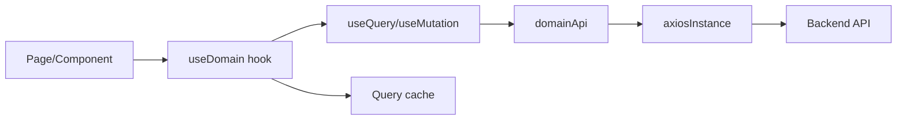

# Tài liệu Hooks và API Frontend

## 1. Phân vai giữa API module và hook

- `api/*.ts`: khai báo type và hàm HTTP. Không chứa state giao diện.
- `hooks/use*.ts`: bọc API bằng TanStack Query, quyết định query key, `enabled`, mutation lifecycle, toast và cache invalidation.
- `axiosInstance.ts`: base URL, Bearer token, bóc `ApiResponse.data`, refresh token và xử lý lỗi phiên.
- Query hook dùng cho đọc; mutation hook dùng cho tạo/sửa/xóa. Không gọi mutation trong render.

QueryProvider của hai ứng dụng cấu hình `staleTime` mặc định 5 phút. Dữ liệu nhạy với thay đổi nhanh như cart, POS draft, chat và payment cần invalidate/refetch chủ động.

# Phần A — Storefront (`fe`)

## 2. API hạ tầng và xác thực

### `api/axiosInstance.ts`

| Thành phần | Hoạt động |
|---|---|
| `BASE_URL` | `VITE_API_URL`, fallback `http://localhost:8080/api/v1`. |
| Request interceptor | Đọc access token từ cookie và gắn Bearer. |
| Response interceptor | Trả trực tiếp `response.data.data` theo wrapper BE. |
| `requestNewAccessToken` | Dùng refresh token gọi `/auth/refresh-token`, lưu access/refresh mới. |
| Refresh queue | Khi nhiều request cùng 401, chỉ tạo một refresh promise; các request còn lại chờ rồi retry. |
| `redirectToLogin` | Clear token và điều hướng login; reason có thể dùng để thông báo inactive/banned/hết phiên. |

Không retry tự động lỗi 409 checkout hoặc POST thanh toán theo cách có thể tạo giao dịch kép.

### `api/authApi.ts` và `hooks/useAuth.ts`

| API method | Endpoint | Hook | Cache/tác dụng |
|---|---|---|---|
| `register(payload)` | `POST /auth/register` | `useRegister` | Lưu token, set auth state, invalidate `AUTH_KEYS.me`. |
| `login(payload)` | `POST /auth/login` | `useLogin` | Lưu token và Customer; chuyển về trang trước/home. |
| `logout()` | `POST /auth/logout` | `useLogout` | Dù request lỗi vẫn clear cookie/cache phiên. |
| `getMe()` | `GET /auth/me` | `useMe` | Query hồ sơ USER; chỉ enable khi có token phù hợp. |
| `updateProfile(payload)` | `PUT /profile` | `useUpdateProfile` | Multipart khi có avatar; invalidate `me`. |
| `changePassword(payload)` | `PUT /change-password` | `useChangePassword` | Mutation, không ghi mật khẩu vào cache. |
| `forgotPassword(payload)` | `POST /auth/forgot-password` | `useForgotPassword` | Hiển thị message BE; email không tồn tại phải báo ngay. |
| `resetPassword(payload)` | `POST /auth/reset-password` | `useResetPassword` | Token + new/confirm password; thành công về login. |

`authStore` giữ trạng thái thuận tiện cho UI, nhưng `/auth/me` và BE mới là nguồn xác nhận tài khoản ACTIVE.

## 3. Catalog API và hooks

### API modules

| Module | Hàm chính và endpoint |
|---|---|
| `productApi` | `getAll` → `/products`; `getById`; `getByCode`; `getTopRated`; `getBestSellers`; `getVariants`; `getPriceRange`. Helper `variantEffectivePrice`, min/max/original price và thumbnail chỉ tính dữ liệu trình bày. |
| `categoryApi` | `getAll` → `/category`, `getById`. |
| `brandApi` | `getAll` → `/brand`, `getById`. |
| `bannerApi` | `getAll` → `/banners` với active/date/page filter. |
| `promotionApi` | `getActive` → `/promotions/active`. |
| `couponApi` | `getActiveCoupons` → `/coupons`; `validate` → `/coupons/validate`; `couponDiscount` tính số giảm hiển thị theo giới hạn coupon. |

### `hooks/useCatalog.ts`

`CATALOG_KEYS` tách key cho product list/detail/code/top-rated/best-seller/category/brand/banner/promotion/coupon/price-range. Các hook:

- `useProducts(params)`: danh sách phụ thuộc toàn bộ filter; params phải nằm trong query key.
- `useProduct(id)`, `useProductByCode(code)`: `enabled` khi ID/code hợp lệ.
- `useTopRatedProducts(limit)`, `useBestSellers(limit)`.
- `useCategories()`, `useBrands()`, `useBanners(params)`.
- `useActivePromotions()`, `useActiveCoupons()`.
- `useProductPriceRange()`.

Các helper giá ở FE chỉ phục vụ hiển thị. Checkout luôn gửi snapshot giá cho BE kiểm tra lại.

## 4. Cart API và hooks

### `api/cartApi.ts`

| Method | Endpoint/chức năng |
|---|---|
| `getMyCart` | `GET /cart`. |
| `addItem({variantId,quantity})` | `POST /cart/items`. |
| `updateItem` | `PUT /cart/items`. |
| `increase(cartItemId)` | `PATCH /cart/items/{id}/increase`. |
| `decrease(cartItemId)` | `PATCH .../decrease`, có thể trả `null` khi dòng bị xóa. |
| `removeItem`, `removeItems` | DELETE một/nhiều dòng. |
| `clear` | `DELETE /cart`. |
| `count`, `total`, `exists` | Các GET tiện ích. |

### `hooks/useCart.ts`

- `CART_KEYS`: `all`, detail, count, total, exists theo variant.
- `useCart`, `useCartCount`, `useCartTotal`: query đọc.
- `useAddToCart`, `useUpdateCartItem`, `useIncreaseCartItem`, `useDecreaseCartItem`, `useRemoveCartItem`, `useClearCart`: mutation.
- Mọi mutation làm thay đổi dòng phải invalidate detail, count, total và exists liên quan. Không dùng cart cache để kết luận hàng đã được giữ.

## 5. Address và vận chuyển

### `api/addressApi.ts` + `hooks/useAddress.ts`

| API method | Hook |
|---|---|
| `getMyAddresses` | `useAddresses` |
| `getDefault` | `useDefaultAddress` |
| `create` | `useCreateAddress` |
| `update` | `useUpdateAddress` |
| `setDefault` | `useSetDefaultAddress` |
| `remove` | `useDeleteAddress` |

Mutation invalidate cả `ADDRESS_KEYS.list` và `default`; update/delete có thể làm địa chỉ mặc định thay đổi.

### `api/vnAddressApi.ts`, `hooks/useVnAddress.ts`, `useAddressSuggestions.ts`

- `getProvinces`: gọi nguồn tỉnh Việt Nam công khai.
- `getWardsByProvince`: gọi `/shipping/ghn/wards-v2` với province code/name.
- `useProvinces`, `useWardsByProvince`: cache danh sách hành chính; ward query chỉ enable khi có tỉnh.
- `useAddressSuggestions(keyword)`: debounce, gọi `/shipping/address-search`; hủy/không áp dụng kết quả cũ khi keyword đổi.

Phí shipping không nằm trong hook này; Checkout gọi `/shipping/ghn/fee` khi đủ địa chỉ.

## 6. Order và Payment

### `api/orderApi.ts`

| Method | Endpoint |
|---|---|
| `create` | `POST /orders` |
| `getById` | `GET /orders/{id}` |
| `getByCode` | `GET /orders/code/{code}` |
| `getMyOrders` | `GET /orders/my` với filter/page |
| `cancel` | `PATCH /orders/{id}/cancel` |
| `cancelUnpaid` | `PATCH /orders/{id}/cancel-unpaid` |

Module khai báo `PriceChange` để đọc payload 409 và các label OrderStatus/PaymentMethod cho UI.

### `hooks/useOrder.ts`

- `useMyOrders(params)`: query phân trang.
- `useMyOrdersInfinite(params)`: infinite query; `getNextPageParam` dựa trên `last/totalPages`.
- `useOrder(orderId)`: detail, enable khi có ID.
- `useCreateOrder`: thành công invalidate orders và cart; lỗi 409 phải được Page giữ lại để mở dialog, không toast chung rồi bỏ payload.
- `useCancelOrder`: invalidate list và detail order bị hủy.

### `api/paymentApi.ts`

- `init(orderId)` → `POST /payments/init`, trả `paymentUrl`, payment/order data.
- `getByOrder(orderId)` → `GET /payments/order/{id}`.
- `vnpayReturn(query)` → `GET /payments/vnpay/return?...`.

Payment hiện được gọi trực tiếp tại page thay vì hook riêng. Nếu bổ sung hook, query key nên là `['payments','order',orderId]`; callback return cần refetch thay vì optimistic PAID.

## 7. Return hooks/API

### `api/returnApi.ts`

- `uploadReturnImage` và `uploadReturnImages`: multipart `/returns/upload`, giới hạn concurrency mặc định 3 để tránh upload đồng loạt quá tải.
- `create` → `POST /returns`.
- `getMyReturns` → `/returns/my`.
- `getById` → `/returns/{id}`.
- `refundPreview` → `/returns/refund-preview`.
- `RETURN_STATUS_LABEL`: nhãn UI.

### `hooks/useReturn.ts`

- `RETURN_KEYS`: list và detail.
- `useMyReturns(params)`, `useReturnDetail(id)`.
- `useCreateReturn`: invalidate return list và order liên quan sau thành công. Preview/upload là thao tác tạm nên không ghi vào cache ReturnRequest.

## 8. Review hooks/API

| API method | Hook | Cache cần cập nhật |
|---|---|---|
| `getByProduct` | `useProductReviews` | product review list |
| `getSummary` | `useReviewSummary` | product summary |
| `getMyReviews` | `useMyReviews` | my list |
| `getMyUnreviewedProducts` | `useMyUnreviewedProducts` | unreviewed list |
| `create` | `useCreateReview` | invalidate bốn nhóm liên quan |
| `update` | `useUpdateReview` | invalidate my/product/summary |
| `remove` | `useDeleteReview` | invalidate my/product/summary/unreviewed |

Create/update dùng multipart; API module tạo FormData từ rating/comment/orderDetailId và files.

## 9. Wishlist hooks/API

`wishlistApi` có `getMyWishlist`, `add`, `remove`, `toggle`, `exists`, `count`, `clear`. `useWishlist.ts` cung cấp:

- `useWishlist(params)`, `useWishlistCount`, `useWishlistExists(variantId)`.
- `useToggleWishlist`, `useRemoveWishlist`, `useClearWishlist`.

Mutation invalidate list/count/exists. Toggle trả boolean trạng thái mới; ProductCard có thể cập nhật icon theo response nhưng vẫn invalidate để đồng bộ đa màn hình.

## 10. Chat hooks/API

`chatApi` cung cấp `getMyConversations`, `getById`, `createConversation`, `getMessages`, `sendMessage`, `getSelectableOrders`, `getAssignments`, `markAsRead`, `close`.

`useChat.ts`:

- `useConversations`: query hội thoại khách.
- `useMessages(conversationId)`: infinite query message, enable theo ID.
- `useCreateConversation`: thêm/invalidate list và set conversation active.
- `useSendMessage(conversationId)`: gửi multipart; có thể append response vào cache nhưng phải khử trùng với message Socket.IO.
- `useCloseConversation`: invalidate conversation/list.

Socket event phải dùng `queryClient.setQueryData` hoặc refetch có kiểm soát; listener không được tạo lại mỗi render.

## 11. Blog, Contact, AI và các hook tiện ích

### Blog

`postApi`: `getAll`, `getById`, `getByCategory`; `postCategoryApi.getAll`. `useBlog.ts` có `usePosts`, `usePost`, `usePostCategories`.

`commentApi` và `useComments`, `useCreateComment`, `useDeleteComment` đang kỳ vọng `/posts/{postId}/comments/**`. BE hiện chưa có Comment controller/entity, vì vậy hook có thể trả 404.

### Contact và AI

- `contactApi.create` → `POST /contacts`; page gọi trực tiếp/mutation cục bộ.
- `aiApi.chat` → `POST /ai/chat`; trả chuỗi phản hồi AI.

### Notification

`notificationApi`: list/unread/count/read/read-all/delete/delete-all. `useNotification.ts` bọc các hàm bằng `NOTIFICATION_KEYS` và invalidate list/unread count sau mutation. BE hiện chưa có Notification controller/entity nên toàn bộ nhóm này chưa hoạt động end-to-end.

### Tiện ích

- `useDebounce<T>`: chỉ cập nhật giá trị sau delay, dùng cho search/suggestion.
- `hooks/use-mobile.ts` (`useIsMobile`): theo dõi media query để đổi layout; phải remove listener khi unmount.

# Phần B — Backoffice (`fe-admin`)

## 12. Axios và auth hooks/API

`fe-admin/api/axiosInstance.ts` có trách nhiệm tương tự storefront nhưng refresh qua `/auth/manager/refresh-token`. Khi refresh thất bại clear token và về `/login`. Hàng đợi request bảo đảm một lần refresh cho nhiều 401 đồng thời.

`authApi` + `useAuth.ts`:

| API/hook | Chức năng |
|---|---|
| `register` / `useRegister` | ADMIN tạo/đăng ký User theo contract manager. |
| `login` / `useLogin` | Login username/password, lưu token. |
| `getMe` / `useMe` | `/me`; nguồn dữ liệu cho PrivateRoute/RoleRoute. |
| `logout` / `useLogout` | Logout manager và clear cache. |
| `updateProfile`, `changePassword` | Cập nhật User hiện tại. |
| `forgotPassword`, `resetPassword` | Quên/đặt lại mật khẩu User. |
| `verifyEmail` / `useVerifyEmail` | Frontend đã có, nhưng BE hiện không có endpoint verify tương ứng. |

`hooks/useMe.ts` là wrapper `useMe` bổ sung/phiên bản cũ; nên thống nhất một nguồn để tránh hai query key hồ sơ.

## 13. Hooks/API CRUD catalog

### Category

- `categoryApi`: getAll/getById/statistics/create/update/delete/exportExcel.
- `useCategoryList`, `useCategoryDetail`, `useCategoryStatictis`, create/update/delete hooks và `useCategoryExportExcel`.
- `useCategoryPage`: composition hook gom filter, page, modal selection và mutations cho `CategoryPage`.
- Mutation invalidate list/statistics/detail; export trả Blob và không ghi cache.

### Brand

- `brandApi`: CRUD, statistics, export multipart logo.
- `useBrandList`, `useBrandDetail`, `useBrandStatictis`, create/update/delete/export hooks.
- Create/update phải gửi FormData; invalidate list/statistics/detail.

### Banner

- `bannerApi`: list/detail/statistics/create/update/delete.
- `useBannerList`, `useBannerDetail`, `useBannerStatistics`, create/update/delete hooks.
- Ảnh bắt buộc khi create, tùy chọn update; mutation invalidate list/statistics.

### Product

`productApi`: `filter`, detail, create/update multipart, delete/restore, changeStatus, bulkDelete, bulkUpdateStatus, deleted list, price range, export Blob.

`useProduct.ts` cung cấp hook tương ứng cho từng method. Các mutation phải invalidate:

- `PRODUCT_KEYS.list` và deleted list.
- Detail của ID bị thay đổi.
- Price range nếu giá có thể đổi.
- Variant/dashboard nếu thay đổi ảnh hưởng tồn/hiển thị.

### ProductVariant

`productVariantApi`: get detail, add one, bulk add, update, delete, restore, change status, filter, bulk delete/status và export.

`useProductVariant.ts` cung cấp `useProductVariantList`, add/bulk-add/update/delete/restore/status/bulk/export hooks. Multipart bulk yêu cầu JSON variants và files đúng thứ tự. Mutation invalidate variant list, product detail/list và dữ liệu POS.

## 14. Customer và User hooks/API

### Customer

`customerApi`: list/detail/create/update/status/statistics, address CRUD/default và searchForPos.

`useCustomer.ts`:

- Query: `useCustomerList`, `useCustomer`, `useCustomerStatistics`, `useCustomerAddresses`.
- Mutation: create/update/status và create/update/delete/default address.
- Address mutation invalidate key địa chỉ của đúng Customer; status mutation invalidate list/detail/statistics/auth nếu đang tác động phiên liên quan.

### User

`userApi`: list/detail, create staff multipart, update role/status/profile, reset password, export, statistics.

`useUser.ts`: list/detail/create/statistics/update role/status/user/export/reset hooks. Sau status/role update invalidate list, detail và statistics. API `updateStatus` hiện gọi endpoint toggle không gửi status cụ thể, nên UI phải lấy response mới thay vì tự đảo state theo giả định.

## 15. Coupon và Promotion hooks/API

### Coupon

- `couponApi`: getList/getById/create/update/setStatus/validate.
- `useCouponList`, `useCouponById`, create/update/status/validate hooks.
- Query key cần chứa keyword, status, type, discountType, dates, customerId và page.
- Mutation invalidate list và detail; validate không invalidate vì là phép kiểm tra không ghi dữ liệu.

### Promotion

- `promotionApi`: getList/getById/create/update/cancel/toggleStatus.
- Hook tương ứng trong `usePromotion.ts`.
- Create/update/cancel/status invalidate list/detail và cả product/variant/active promotion caches vì giá storefront/POS có thể thay đổi.

## 16. Order hooks/API và dashboard

`orderApi`:

| Method | Chức năng |
|---|---|
| `getAll` | `/manager/orders` với filter/page. |
| `getById` | `/manager/orders/{id}`. |
| `updateStatus` | PUT status + note. |
| `createPosOrder` | Tạo POS theo flow không-draft/legacy. |
| `bulkUpdateStatus` | Cập nhật nhiều đơn. |
| `getStatistics` | Thống kê theo fromDate/toDate; frontend kỳ vọng endpoint BE tương ứng. |

`useOrder.ts`: list/detail/update status/create POS/statistics. Update status invalidate list, detail, statistics và return/payment nếu transition tác động các domain đó.

`useOrderStatistics(params)` dùng query key gồm cả khoảng ngày. Hiện cần đồng bộ BE vì `OrderController` đã kiểm kê chưa thể hiện mapping statistics; dashboard có thể 404 nếu endpoint chưa được bổ sung.

## 17. POS API và `usePosDraft`

`posApi` ánh xạ trực tiếp:

- `createDraft`, `getDrafts`, `getDraftById`, `cancelDraft`.
- `addItem`, `updateItem`, `removeItem`.
- `attachCustomer`, `checkout`.
- `getActivePromotions`, `calculateShippingFee`.

`usePosDraft.ts` có query draft list/detail và mutation tương ứng. Quy tắc cache:

1. Add/update/remove/attach customer: invalidate detail draft hiện tại và draft list summary.
2. Cancel: remove detail cache, invalidate list và product availability.
3. Checkout: remove/disable draft cache; invalidate orders, statistics, product variants, coupons và reservations/tồn thể hiện qua response mới.
4. Không optimistic update tồn kho; dùng OrderResponse từ BE vì reservation có thể xung đột.

## 18. Return hooks/API

`returnApi`: upload, getAll, getStatistics, detail, create, approve, reject, complete.

`useReturn.ts`:

- `useReturnList`, `useReturnDetail`.
- `useCreateReturn`, `useApproveReturn`, `useRejectReturn`, `useCompleteReturn`.
- Sau approve/reject invalidate list/detail/statistics.
- Sau complete còn phải invalidate Order, Payment, ProductVariant, dashboard và coupon liên quan; đây là mutation đa-domain.

Complete payload hỗ trợ `processedImages` và damaged quantity từng return item.

## 19. Chat hooks/API phía nhân viên

`chatApi`: assigned conversations, pending queue, assign staff, messages, send multipart, close, all conversations cho admin.

`useChat.ts`:

- `useAssignedConversations(status)`, `usePendingConversations`, `useAllConversations(status)`.
- `useAssignStaff`: invalidate pending, assigned và all.
- `useMessages(conversationId)`: infinite query.
- `useSendMessage`: append/refresh message và conversation lastMessage.
- `useCloseConversation`: invalidate mọi list chứa conversation.

Socket message/assignment phải cập nhật đúng key theo role và chống trùng với mutation response.

## 20. Content, moderation và marketing

### Post

`postApi`: admin list/detail/statistics/create/update/status/delete. `usePost.ts` cung cấp hook tương ứng. Create/update multipart; invalidate list/detail/statistics. Endpoint `/admin/posts/statistics` hiện chưa có ở BE.

### PostCategory/PostTag

`api/postCategoryApi.ts`, `api/postTagApi.ts`, `hooks/usePostCategory.ts` và `hooks/usePostTag.ts` cung cấp list/detail/create/update/delete. Mutation taxonomy cũng nên invalidate Post form option/list, không chỉ taxonomy list.

### Review

`reviewApi`: filter, approve, reject, hide, delete. `useReview.ts` invalidate admin review list; moderation còn ảnh hưởng review công khai và product rating/summary.

### Contact

`contactApi`: list/detail/statistics/update status/delete. `useContact.ts` invalidate list/detail/statistics sau update/delete.

### Marketing

`marketingApi.sendPromotion` + `hooks/useMarketing.ts` (`useSendPromotionEmail`): POST chiến dịch email; mutation chỉ báo kết quả, không cần cache dài hạn. Nút gửi phải disable khi pending để tránh gửi trùng.

## 21. Supplier và Inventory chưa có BE contract

### Supplier

`supplierApi` và `useSupplier.ts` đã có list/detail/statistics/create/update/delete/restore. Route `/suppliers` đang được mount, nhưng BE hiện không có Supplier controller/entity. Các hook sẽ lỗi 404 cho đến khi bổ sung contract hoặc gỡ module.

### Inventory/Goods Receipt

`inventoryApi`, `goodsReceiptApi` và `useInventory.ts` có:

- Inventory list/detail/transactions/adjust stock.
- Receipt list/detail/create/approve/delete.
- Query keys `INVENTORY_KEYS`, `RECEIPT_KEYS` và invalidation chéo sau approve receipt.

BE hiện chỉ quản lý `ProductVariant.stockQuantity` trong các service Order/POS/Return, chưa có controller Inventory/Receipt. Hai Page cũng chưa được khai báo route. Không nên coi các hook này đã hoạt động.

## 22. Hooks địa chỉ và tiện ích backoffice

- `useVnAddress.ts`: provinces/wards cache cho customer/user/POS forms.
- `useAddressSuggestions.ts`: debounce tìm địa chỉ qua BE.
- `useDebounce`: trì hoãn search input.
- `hooks/use-mobile.ts` (`useIsMobile`): responsive behavior.
- `useSupplier`, `useInventory` chỉ kích hoạt khi module BE được triển khai.

## 23. Quy tắc query key và invalidation

| Thao tác | Query tối thiểu phải invalidate |
|---|---|
| Sửa Product/Variant | product list/detail, variant list/detail, catalog/price range, POS products. |
| Đổi Promotion | promotion list/detail/active, product/variant price, cart/checkout display. |
| Đổi Coupon | coupon list/detail/active; checkout phải validate lại. |
| Cart mutation | cart detail/count/total/exists. |
| Tạo/hủy Order | order list/detail, cart, product availability, dashboard. |
| POS draft item | draft detail/list và product availability hiển thị. |
| POS checkout | drafts, orders, variants, dashboard, coupon. |
| Complete Return | return, order, payment, variant/tồn, dashboard. |
| Moderation Review | admin list, public product reviews/summary, product rating. |
| Khóa Customer/User | account list/detail/statistics; phiên thực tế do BE từ chối. |

## 24. Quy tắc `enabled`, pagination và race condition

- Detail query chỉ `enabled` khi ID hợp lệ; không gửi `/undefined` hoặc `/0` ngoài ý muốn.
- Query key phải chứa mọi filter ảnh hưởng response.
- Reset page về 0 khi keyword/status/date filter đổi.
- Infinite query lấy next page từ metadata BE, không dựa vào độ dài mảng tùy tiện.
- Search dùng debounce và bỏ kết quả cũ.
- Coupon validation dùng generation/request identity để response cũ không ghi đè subtotal mới.
- Socket và mutation cùng thêm message phải khử trùng theo `messageId`.
- Upload nhiều ảnh giới hạn concurrency và giữ đúng thứ tự khi API yêu cầu.

## 25. Tài liệu liên quan

- [Chi tiết component](./frontend-component-documentation.md)
- [Frontend theo trang và luồng](./frontend-documentation.md)
- [Tài liệu API Backend](./api-function-documentation.md)
- [Quy trình nghiệp vụ](./business-flows.md)
