# ERD tổng thể

Sơ đồ tập trung vào khóa và quan hệ; danh sách thuộc tính nghiệp vụ đầy đủ xem tại [entity-documentation.md](./entity-documentation.md).

```mermaid
erDiagram
    USER { bigint user_id PK }
    CUSTOMER { bigint customer_id PK }
    ADDRESS { bigint address_id PK bigint customer_id FK }
    REFRESH_TOKEN { bigint id PK bigint user_id FK bigint customer_id FK }
    PASSWORD_RESET_TOKEN { bigint id PK string email string account_type }

    CATEGORY { bigint category_id PK }
    BRAND { bigint brand_id PK }
    PRODUCT { bigint product_id PK bigint category_id FK bigint brand_id FK }
    PRODUCT_VARIANT { bigint variant_id PK bigint product_id FK int stock_quantity }
    PRODUCT_IMAGE { bigint image_id PK bigint product_id FK bigint variant_id FK }
    PROMOTION { bigint promotion_id PK }
    COUPON { bigint coupon_id PK }
    RESERVATION { bigint reservation_id PK bigint order_id FK bigint variant_id FK }

    CART { bigint cart_id PK bigint customer_id FK }
    CART_ITEM { bigint cart_item_id PK bigint cart_id FK bigint variant_id FK }
    WISHLIST { bigint wishlist_id PK bigint customer_id FK bigint variant_id FK }
    ORDER { bigint order_id PK bigint customer_id FK bigint coupon_id FK bigint staff_id FK }
    ORDER_DETAIL { bigint order_detail_id PK bigint order_id FK bigint variant_id FK }
    ORDER_ADDRESS { bigint order_address_id PK bigint order_id FK }
    ORDER_TRANSACTION_LOG { bigint id PK bigint order_id FK }
    PAYMENT { bigint payment_id PK bigint order_id FK }
    RETURN_REQUEST { bigint return_id PK bigint order_id FK bigint created_by FK bigint processed_by FK }
    RETURN_ITEM { bigint return_item_id PK bigint return_id FK bigint variant_id FK }
    EXCHANGE_ITEM { bigint exchange_item_id PK bigint return_id FK bigint variant_id FK }

    REVIEW { bigint review_id PK bigint customer_id FK bigint product_id FK bigint variant_id FK bigint order_detail_id FK }
    REVIEW_IMAGE { bigint image_id PK bigint review_id FK }
    CONTACT { bigint contact_id PK }
    CONVERSATION { bigint conversation_id PK bigint customer_id FK bigint staff_id FK }
    MESSAGE { bigint message_id PK bigint conversation_id FK bigint customer_id FK bigint user_id FK bigint order_id FK }
    CONVERSATION_ASSIGNMENT { bigint id PK bigint conversation_id FK bigint user_id FK bigint performed_by FK }
    BANNER { bigint banner_id PK }
    POST { bigint post_id PK bigint author_id FK }
    POST_CATEGORY { bigint category_id PK }
    POST_TAG { bigint tag_id PK }

    COUPON_CUSTOMER { bigint coupon_id FK bigint customer_id FK }
    PROMOTION_CATEGORY { bigint promotion_id FK bigint category_id FK }
    PROMOTION_PRODUCT { bigint promotion_id FK bigint product_id FK }
    PROMOTION_VARIANT { bigint promotion_id FK bigint variant_id FK }
    POST_CATEGORY_MAPPING { bigint post_id FK bigint category_id FK }
    POST_TAG_MAPPING { bigint post_id FK bigint tag_id FK }

    CUSTOMER ||--o{ ADDRESS : owns
    CUSTOMER ||--|| CART : has
    CART ||--o{ CART_ITEM : contains
    PRODUCT_VARIANT ||--o{ CART_ITEM : selected
    CUSTOMER ||--o{ WISHLIST : saves
    PRODUCT_VARIANT ||--o{ WISHLIST : wished
    USER ||--o{ REFRESH_TOKEN : authenticates
    CUSTOMER ||--o{ REFRESH_TOKEN : authenticates

    CATEGORY ||--o{ PRODUCT : classifies
    BRAND ||--o{ PRODUCT : brands
    PRODUCT ||--o{ PRODUCT_VARIANT : has
    PRODUCT ||--o{ PRODUCT_IMAGE : has
    PRODUCT_VARIANT ||--o| PRODUCT_IMAGE : represented_by

    COUPON ||--o{ COUPON_CUSTOMER : targets
    CUSTOMER ||--o{ COUPON_CUSTOMER : eligible
    PROMOTION ||--o{ PROMOTION_CATEGORY : applies
    CATEGORY ||--o{ PROMOTION_CATEGORY : targeted
    PROMOTION ||--o{ PROMOTION_PRODUCT : applies
    PRODUCT ||--o{ PROMOTION_PRODUCT : targeted
    PROMOTION ||--o{ PROMOTION_VARIANT : applies
    PRODUCT_VARIANT ||--o{ PROMOTION_VARIANT : targeted

    CUSTOMER o|--o{ ORDER : places
    USER o|--o{ ORDER : handles
    COUPON o|--o{ ORDER : discounts
    ORDER ||--|{ ORDER_DETAIL : contains
    PRODUCT_VARIANT ||--o{ ORDER_DETAIL : sold_as
    ORDER ||--o| ORDER_ADDRESS : ships_to
    ORDER ||--o| PAYMENT : paid_by
    ORDER ||--o{ ORDER_TRANSACTION_LOG : logs
    ORDER ||--o{ RESERVATION : holds
    PRODUCT_VARIANT ||--o{ RESERVATION : reserved

    ORDER ||--o{ RETURN_REQUEST : has
    USER o|--o{ RETURN_REQUEST : creates
    USER o|--o{ RETURN_REQUEST : processes
    RETURN_REQUEST ||--|{ RETURN_ITEM : returns
    PRODUCT_VARIANT ||--o{ RETURN_ITEM : returned_variant
    RETURN_REQUEST ||--o{ EXCHANGE_ITEM : exchanges
    PRODUCT_VARIANT ||--o{ EXCHANGE_ITEM : replacement_variant

    CUSTOMER ||--o{ REVIEW : writes
    PRODUCT ||--o{ REVIEW : receives
    PRODUCT_VARIANT o|--o{ REVIEW : variant_reviewed
    ORDER_DETAIL ||--o| REVIEW : verifies_purchase
    REVIEW ||--o{ REVIEW_IMAGE : includes

    CUSTOMER ||--o{ CONVERSATION : opens
    USER o|--o{ CONVERSATION : assigned_to
    CONVERSATION ||--o{ MESSAGE : contains
    CUSTOMER o|--o{ MESSAGE : sends
    USER o|--o{ MESSAGE : sends
    ORDER o|--o{ MESSAGE : referenced
    CONVERSATION ||--o{ CONVERSATION_ASSIGNMENT : assignment_history
    USER ||--o{ CONVERSATION_ASSIGNMENT : assignee
    USER ||--o{ CONVERSATION_ASSIGNMENT : performed_by

    USER ||--o{ POST : authors
    POST ||--o{ POST_CATEGORY_MAPPING : classified
    POST_CATEGORY ||--o{ POST_CATEGORY_MAPPING : includes
    POST ||--o{ POST_TAG_MAPPING : tagged
    POST_TAG ||--o{ POST_TAG_MAPPING : includes
```

## Lưu ý mô hình

- `PasswordResetToken` liên kết logic bằng `email` và `accountType`, không có FK trực tiếp.
- `RefreshToken` và `Message` có hai FK chủ thể nullable; ở mỗi bản ghi chỉ một loại chủ thể/người gửi nên được đặt.
- Quan hệ 1-1 Order–Payment, Order–OrderAddress, OrderDetail–Review nên có unique constraint tương ứng ở database.
- Các quan hệ bảng nối được vẽ thành associative entity để nhìn rõ khóa ngoại.
