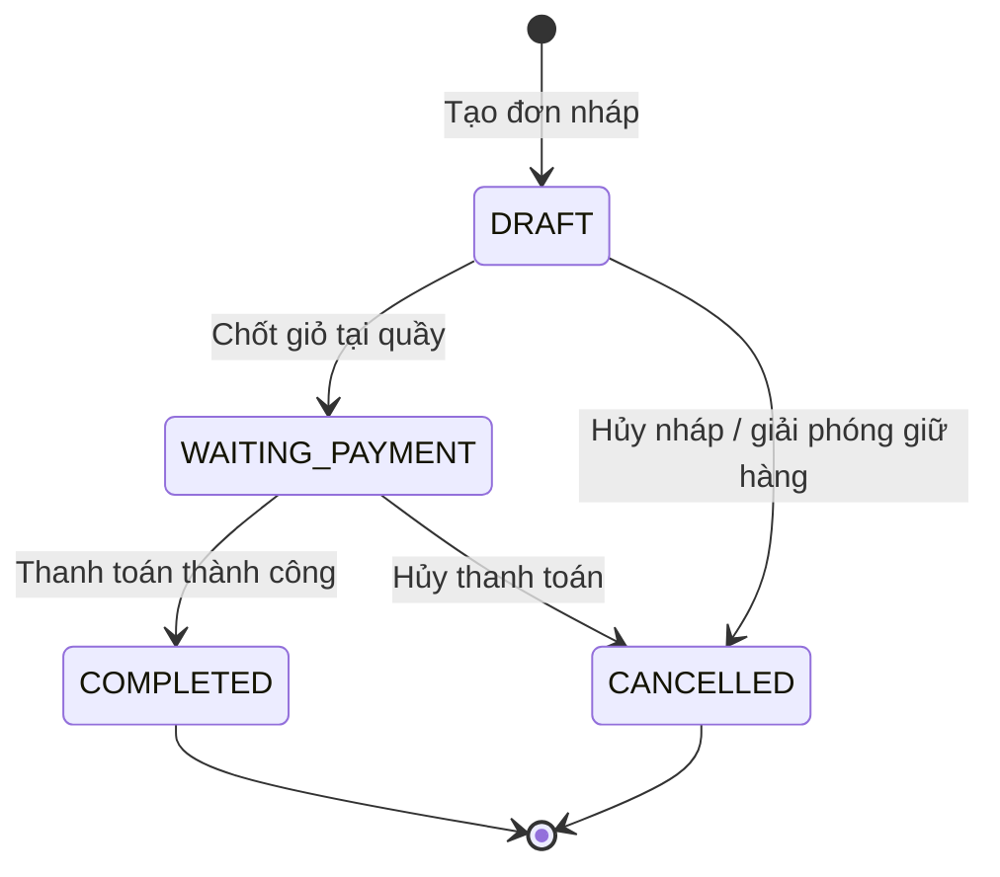
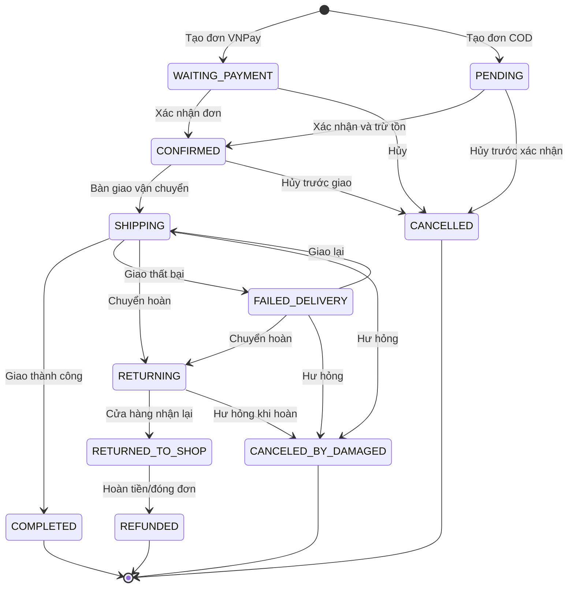
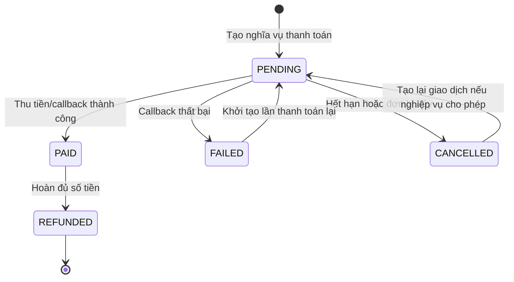
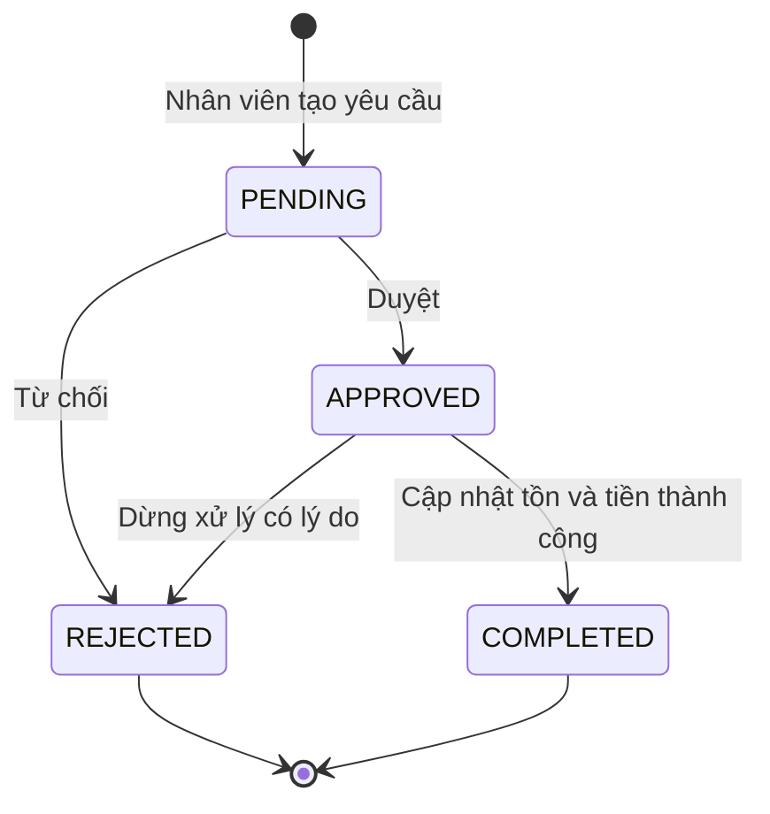
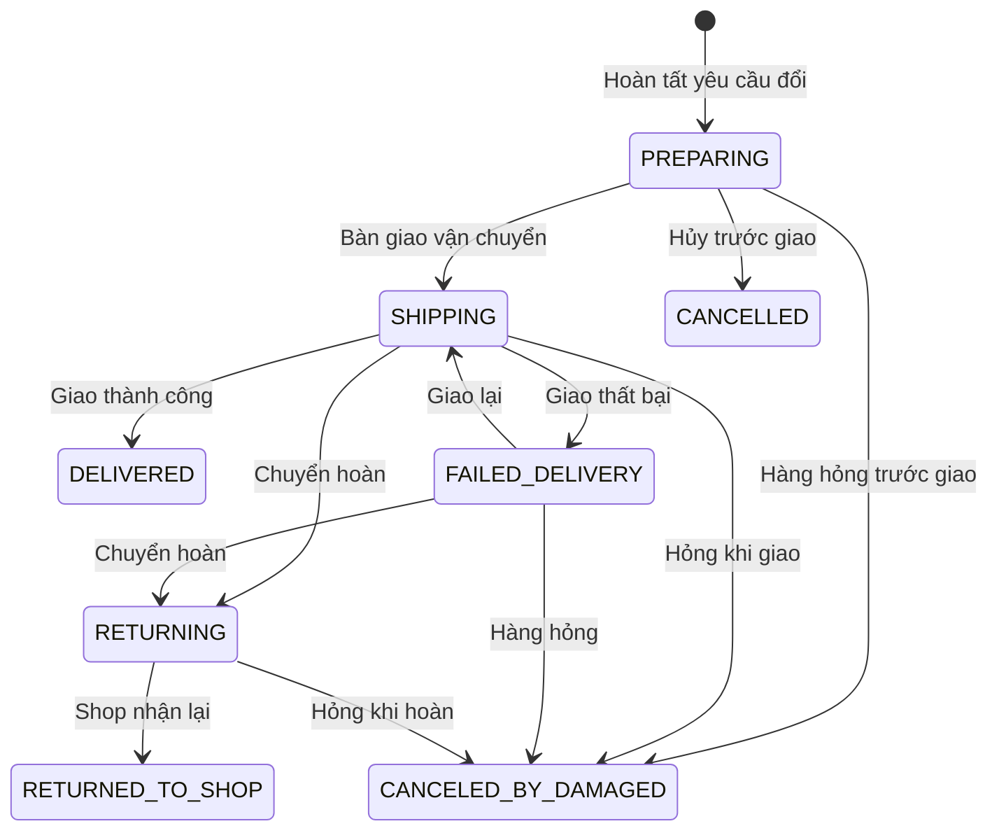
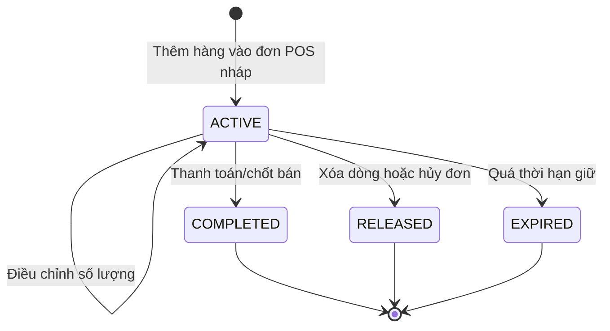
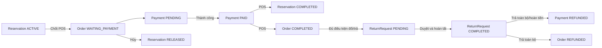

# Sơ đồ trạng thái nghiệp vụ

Các sơ đồ dưới đây phản ánh enum và các transition đang được service cho phép. Trạng thái kết thúc không có nghĩa bản ghi bị xóa; dữ liệu vẫn được giữ để đối soát.

## 1. Order

### Đơn POS

### Đơn giao hàng

`REFUNDED` cũng có thể được đặt khi một yêu cầu trả toàn bộ dạng REFUND hoàn tất. Mỗi transition quan trọng phải sinh `OrderTransactionLog`.

## 2. Payment

Lưu ý: code có thể đặt lại payment hiện hữu về `PENDING` khi tạo URL VNPay mới. `refundedAmount` theo dõi hoàn một phần; chỉ khi hoàn đủ mới chuyển trạng thái `REFUNDED`.

## 3. ReturnRequest

Chỉ `APPROVED` được hoàn tất. `ReturnType` hiện gồm `REFUND`, `EXCHANGE`, `DAMAGED`, `WRONG_ITEM`, nhưng luồng tạo đổi/trả thông thường chỉ chấp nhận REFUND hoặc EXCHANGE; hai giá trị còn lại mang ý nghĩa nguyên nhân/ngoại lệ và cần quy tắc riêng nếu mở rộng.

### Giao sản phẩm đổi

Các lần chuyển trạng thái được lưu trong `ExchangeDeliveryLog`. `FAILED_DELIVERY`, `RETURNING` và `CANCELED_BY_DAMAGED` yêu cầu lý do cùng ảnh bằng chứng. Khi `CANCELLED` hoặc `RETURNED_TO_SHOP`, hàng đổi được hoàn kho; với hàng hỏng chỉ phần không hỏng được hoàn kho và mỗi phiếu chỉ hoàn kho một lần.

## 4. Reservation

`ACTIVE` phải được tính vào số lượng đang giữ. `COMPLETED` cho biết reservation đã được tiêu thụ khi bán; `RELEASED` và `EXPIRED` không còn giữ hàng. Việc chuyển sang `EXPIRED` cần tiến trình tự động dựa trên `expiredAt`; enum và cột đã tồn tại nhưng không nên giả định tự chạy nếu chưa cấu hình scheduler tương ứng.

## 5. Quan hệ giữa bốn máy trạng thái

Không được suy ra rằng mọi Order đều có Reservation: Reservation chủ yếu phục vụ POS nháp, còn đơn online đang claim và trừ tồn trực tiếp.
